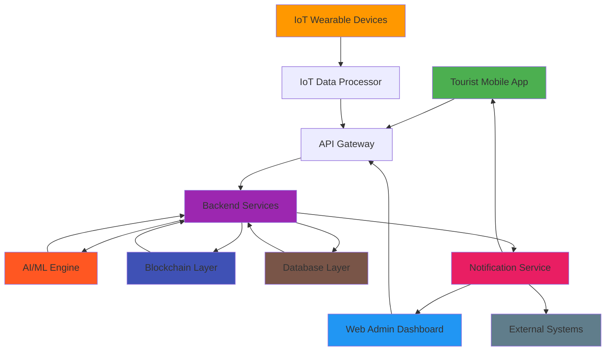

# Smart Tourist Safety Monitoring & Incident Response System

This project implements a comprehensive safety monitoring and incident response system for tourists using AI, Blockchain, IoT, and Mobile technologies. The system is specifically designed for India's tourism sector with features tailored for remote and high-risk regions.

## Table of Contents

- [System Overview](#system-overview)
- [Key Features](#key-features)
- [Technology Stack](#technology-stack)
- [System Architecture](#system-architecture)
- [Components](#components)
- [Installation](#installation)
- [Deployment](#deployment)
- [Documentation](#documentation)
- [Contributing](#contributing)
- [License](#license)

## System Overview

The Smart Tourist Safety System is an integrated digital ecosystem that enhances the safety and security of tourists, particularly in remote or high-risk regions like Northeast India. The system addresses the current reliance on traditional policing by providing a proactive, technology-driven solution that offers:

- Real-time monitoring and instant emergency response
- Secure and verified digital identity management
- Proactive risk mitigation through AI-powered analytics
- Operational intelligence for authorities
- Universal accessibility regardless of language or ability

## Key Features

### 1. Digital Tourist ID Generation Platform (Blockchain-Based)
- Verifiable, time-bound digital identity for each tourist
- Web portal for registration at entry points
- Integration with KYC sources (Aadhaar, Passport API)
- Blockchain-based immutable identity storage
- Automatic expiration upon scheduled departure

### 2. Tourist Mobile Application
- Dynamic "Safety Score" based on real-time travel patterns
- Proactive Geo-fencing Alerts for high-risk zones
- One-touch Panic Button for emergency situations
- Opt-in Tracking for family/friends and law enforcement
- Multilingual Support in 10+ Indian languages

### 3. AI-Powered Anomaly Detection Engine
- Sudden Stoppage/Location Drop-off Detection
- Prolonged Inactivity Identification
- Route Deviation Analysis
- Behavioral Pattern Recognition
- Risk Scoring Algorithms

### 4. Tourism Department & Police Dashboard
- Real-Time Visualizations with heat maps and overlays
- Searchable access to all digital ID records
- Automated E-FIR Generation for missing persons cases
- Incident Management and Dispatch Tracking
- Analytics and Predictive Modeling

### 5. IoT Integration
- Wearable devices with continuous location tracking
- Health metrics monitoring (heart rate, temperature)
- Physical, waterproof manual SOS button
- Extended connectivity beyond smartphone-dependent areas

## Technology Stack

### Frontend
- **Mobile App**: React Native
- **Web Dashboard**: React with Material-UI
- **Real-Time Updates**: WebSocket, Server-Sent Events

### Backend
- **Runtime**: Node.js
- **Framework**: Express.js
- **API**: RESTful with JSON
- **Authentication**: JWT, OAuth 2.0

### AI/ML
- **Framework**: Python with scikit-learn, TensorFlow.js
- **Data Processing**: Pandas, NumPy
- **Model Deployment**: Flask

### Blockchain
- **Platform**: Ethereum/Hyperledger Fabric
- **Smart Contracts**: Solidity
- **Integration**: Web3.js

### IoT
- **Devices**: ESP32, Raspberry Pi
- **Communication**: BLE, MQTT
- **Security**: Hardware security modules

### Database
- **Primary**: PostgreSQL with PostGIS
- **Caching**: Redis
- **Document Storage**: MongoDB

### Infrastructure
- **Cloud**: AWS/Google Cloud
- **Containerization**: Docker, Kubernetes
- **Monitoring**: Prometheus, Grafana

## System Architecture



## Components

### 1. Mobile Application ([mobile-app/](mobile-app/))
- Tourist-facing mobile application built with React Native
- Features include safety dashboard, digital identity wallet, incident reporting
- Multilingual support for Indian languages
- Integration with IoT wearable devices

### 2. Web Application ([web-app/](web-app/))
- Administration dashboard for authorities built with React
- Real-time visualizations, incident management, tourist verification
- Dispatch tracking and analytics reporting
- E-FIR generation and blockchain integration

### 3. Blockchain ([blockchain/](blockchain/))
- Smart contracts for digital identity management
- Ethereum-based implementation with Solidity
- Identity verification and revocation mechanisms
- Immutable audit trail for all identity actions

### 4. AI Engine ([ai/](ai/))
- Machine learning models for anomaly detection
- Location drop-off, inactivity, and route deviation detection
- Python implementation with scikit-learn
- RESTful API for integration with backend services

### 5. IoT Framework ([iot/](iot/))
- Device simulator and data processor for wearable devices
- MQTT-based communication protocol
- Health metrics monitoring and emergency alerting
- RESTful API for device management

### 6. Security Framework ([security/](security/))
- Data privacy and security implementation
- Compliance with Indian Data Protection laws
- Encryption, authentication, and access control
- Audit and monitoring systems

### 7. Documentation ([docs/](docs/))
- System architecture and design documents
- Deployment guide and user manual
- API documentation and developer guides
- Security and compliance documentation

## Installation

### Prerequisites
- Node.js (v16 or higher)
- Python (v3.8 or higher)
- Docker and Docker Compose
- PostgreSQL, Redis
- Ethereum development tools (Truffle, Ganache)

### Mobile App Installation
```bash
cd mobile-app
npm install
npx react-native run-ios   # For iOS
npx react-native run-android   # For Android
```

### Web App Installation
```bash
cd web-app
npm install
npm start
```

### Backend Services
```bash
cd web-app
npm install
node server.js
```

### AI Engine
```bash
cd ai
pip install -r requirements.txt
python app.py
```

### Blockchain
```bash
cd blockchain
npm install
truffle compile
truffle migrate
```

### IoT Framework
```bash
cd iot
pip install -r requirements.txt
python api_service.py
```

## Deployment

For detailed deployment instructions, please refer to the [Deployment Guide](docs/deployment_guide.md).

### Quick Deployment with Docker
```bash
# Build and start all services
docker-compose up -d

# View service logs
docker-compose logs -f

# Stop all services
docker-compose down
```

## Documentation

### System Documentation
- [System Architecture](docs/system_architecture.md) - Complete system design and architecture
- [Deployment Guide](docs/deployment_guide.md) - Step-by-step deployment instructions
- [User Manual](docs/user_manual.md) - Comprehensive user guide for all components

### Component Documentation
- [Mobile App README](mobile-app/README.md) - Mobile application documentation
- [Web App README](web-app/README.md) - Web application documentation
- [Blockchain README](blockchain/README.md) - Blockchain component documentation
- [AI Engine README](ai/README.md) - AI engine documentation
- [IoT Framework README](iot/README.md) - IoT framework documentation

### Security Documentation
- [Privacy Policy](security/privacy_policy.md) - Data privacy and protection policy
- [Security Implementation Guide](security/implementation_guide.md) - Technical security implementation details
- [Compliance Checklist](security/compliance_checklist.md) - Indian Data Protection compliance checklist

## Contributing

We welcome contributions to the Smart Tourist Safety System! Please follow these steps:

1. Fork the repository
2. Create a feature branch (`git checkout -b feature/AmazingFeature`)
3. Commit your changes (`git commit -m 'Add some AmazingFeature'`)
4. Push to the branch (`git push origin feature/AmazingFeature`)
5. Open a Pull Request

Please read [CONTRIBUTING.md](CONTRIBUTING.md) for detailed information on our code of conduct and development process.

## License

This project is licensed under the MIT License - see the [LICENSE](LICENSE) file for details.

## Contact

For support, questions, or feedback, please contact:
- **Email**: info@smartsafetysystem.in
- **Website**: https://www.smartsafetysystem.in
- **Support**: support@smartsafetysystem.in

---

*The Smart Tourist Safety System is designed to make tourism in India safer and more secure through innovative technology solutions.*