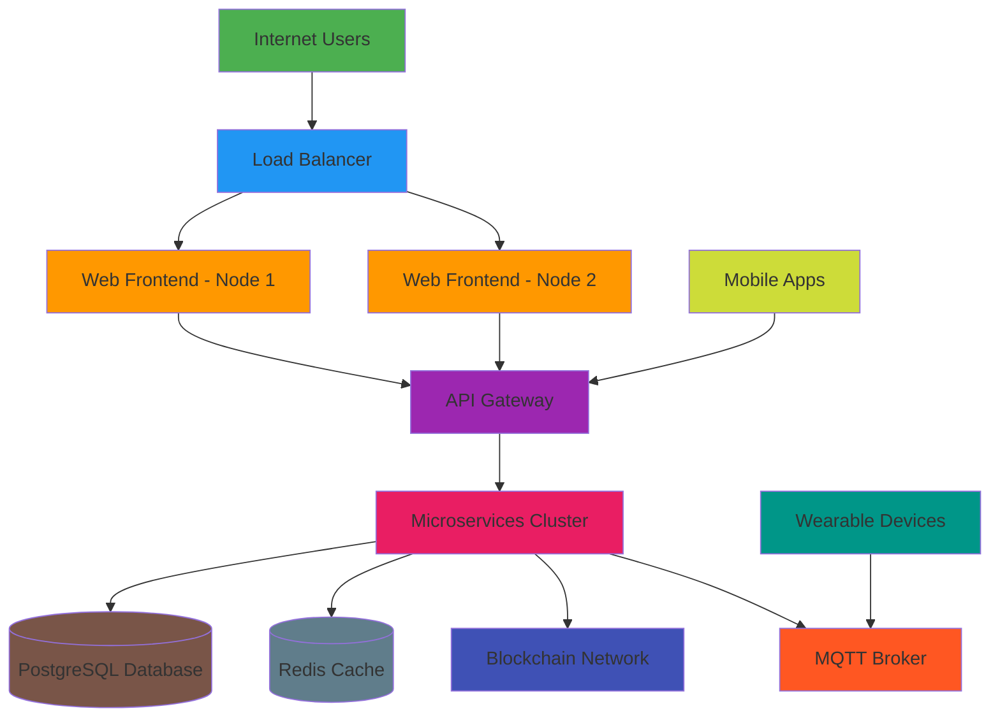

# Smart Tourist Safety System - Deployment Guide

## Overview

This guide provides step-by-step instructions for deploying the Smart Tourist Safety Monitoring & Incident Response System in production environments. The system consists of multiple interconnected components that must be deployed and configured correctly for optimal performance and security.

## Prerequisites

### System Requirements

#### Minimum Hardware Requirements
- **Web Application Server**: 4 CPU cores, 8GB RAM, 50GB SSD storage
- **Database Server**: 4 CPU cores, 16GB RAM, 100GB SSD storage
- **AI/ML Server**: 8 CPU cores, 32GB RAM, 200GB SSD storage, GPU recommended
- **Blockchain Node**: 4 CPU cores, 16GB RAM, 500GB SSD storage
- **IoT Gateway**: 2 CPU cores, 4GB RAM, 32GB storage

#### Software Requirements
- **Operating System**: Ubuntu 20.04 LTS or CentOS 8
- **Container Runtime**: Docker 20.10+
- **Container Orchestration**: Kubernetes 1.24+
- **Database**: PostgreSQL 14+, Redis 6+
- **Message Broker**: RabbitMQ 3.9+ or Apache Kafka 3.0+
- **Reverse Proxy**: Nginx 1.20+ or Apache 2.4+

### Network Requirements
- **Public IP Address**: For web application access
- **SSL Certificate**: For HTTPS encryption
- **Firewall Configuration**: Ports 80, 443, 5432, 6379, 1883 (MQTT)
- **Domain Name**: For production deployment

## Deployment Architecture

### Production Deployment Diagram


## Step-by-Step Deployment

### 1. Environment Setup

#### Server Provisioning
```bash
# Update system packages
sudo apt update && sudo apt upgrade -y

# Install essential tools
sudo apt install -y curl wget git unzip docker.io docker-compose

# Install Kubernetes tools (if using Kubernetes)
curl -LO "https://dl.k8s.io/release/$(curl -L -s https://dl.k8s.io/release/stable.txt)/bin/linux/amd64/kubectl"
sudo install -o root -g root -m 0755 kubectl /usr/local/bin/kubectl

# Install Helm (Kubernetes package manager)
curl https://raw.githubusercontent.com/helm/helm/main/scripts/get-helm-3 | bash
```

#### Docker Configuration
```bash
# Start and enable Docker
sudo systemctl start docker
sudo systemctl enable docker

# Add current user to docker group
sudo usermod -aG docker $USER

# Verify Docker installation
docker --version
```

### 2. Database Deployment

#### PostgreSQL Setup
```bash
# Create docker-compose.yml for PostgreSQL
cat > postgres-compose.yml << EOF
version: '3.8'
services:
  postgres:
    image: postgres:14
    container_name: tourist_safety_postgres
    environment:
      POSTGRES_DB: tourist_safety
      POSTGRES_USER: safety_user
      POSTGRES_PASSWORD: secure_password_here
    volumes:
      - postgres_data:/var/lib/postgresql/data
      - ./init-scripts:/docker-entrypoint-initdb.d
    ports:
      - "5432:5432"
    networks:
      - safety_network
    restart: unless-stopped

volumes:
  postgres_data:

networks:
  safety_network:
    driver: bridge
EOF

# Start PostgreSQL
docker-compose -f postgres-compose.yml up -d
```

#### Redis Setup
```bash
# Create docker-compose.yml for Redis
cat > redis-compose.yml << EOF
version: '3.8'
services:
  redis:
    image: redis:6-alpine
    container_name: tourist_safety_redis
    command: redis-server --appendonly yes
    volumes:
      - redis_data:/data
    ports:
      - "6379:6379"
    networks:
      - safety_network
    restart: unless-stopped

volumes:
  redis_data:

networks:
  safety_network:
    driver: bridge
EOF

# Start Redis
docker-compose -f redis-compose.yml up -d
```

### 3. Blockchain Network Deployment

#### Ethereum Node Setup
```bash
# Create docker-compose.yml for Ethereum node
cat > ethereum-compose.yml << EOF
version: '3.8'
services:
  ethereum-node:
    image: ethereum/client-go:latest
    container_name: tourist_safety_ethereum
    command: --http --http.addr 0.0.0.0 --http.port 8545 --http.api eth,net,web3,personal
    ports:
      - "8545:8545"
      - "30303:30303"
    volumes:
      - ethereum_data:/root/.ethereum
    networks:
      - safety_network
    restart: unless-stopped

volumes:
  ethereum_data:

networks:
  safety_network:
    driver: bridge
EOF

# Start Ethereum node
docker-compose -f ethereum-compose.yml up -d
```

#### Smart Contract Deployment
```bash
# Navigate to blockchain directory
cd /path/to/smart-tourist-safety/blockchain

# Install dependencies
npm install

# Compile smart contracts
npx truffle compile

# Deploy to local network
npx truffle migrate --reset

# Note the deployed contract addresses for configuration
```

### 4. IoT Infrastructure Deployment

#### MQTT Broker Setup
```bash
# Create docker-compose.yml for MQTT broker
cat > mqtt-compose.yml << EOF
version: '3.8'
services:
  mosquitto:
    image: eclipse-mosquitto:2
    container_name: tourist_safety_mqtt
    ports:
      - "1883:1883"
      - "9001:9001"
    volumes:
      - ./mosquitto/config:/mosquitto/config
      - ./mosquitto/data:/mosquitto/data
      - ./mosquitto/log:/mosquitto/log
    networks:
      - safety_network
    restart: unless-stopped
EOF

# Create MQTT configuration
mkdir -p mosquitto/config
cat > mosquitto/config/mosquitto.conf << EOF
listener 1883
allow_anonymous false
password_file /mosquitto/config/mosquitto.passwd

listener 9001
protocol websockets
EOF

# Start MQTT broker
docker-compose -f mqtt-compose.yml up -d
```

### 5. Backend Services Deployment

#### API Gateway and Microservices
```bash
# Navigate to web-app directory
cd /path/to/smart-tourist-safety/web-app

# Install dependencies
npm install

# Create environment configuration
cat > .env << EOF
NODE_ENV=production
PORT=5000
DB_HOST=postgres
DB_PORT=5432
DB_NAME=tourist_safety
DB_USER=safety_user
DB_PASSWORD=secure_password_here
REDIS_HOST=redis
REDIS_PORT=6379
ETHEREUM_NODE=http://ethereum-node:8545
MQTT_BROKER=mqtt://mosquitto:1883
JWT_SECRET=your_jwt_secret_here
ENCRYPTION_KEY=your_encryption_key_here
EOF

# Build Docker image
docker build -t tourist-safety-backend .

# Create docker-compose.yml for backend services
cat > backend-compose.yml << EOF
version: '3.8'
services:
  backend-api:
    image: tourist-safety-backend
    container_name: tourist_safety_backend
    ports:
      - "5000:5000"
    environment:
      - NODE_ENV=production
    env_file:
      - .env
    depends_on:
      - postgres
      - redis
      - ethereum-node
      - mosquitto
    networks:
      - safety_network
    restart: unless-stopped

  ai-engine:
    image: tourist-safety-backend
    container_name: tourist_safety_ai
    command: python /app/ai/app.py
    ports:
      - "5001:5001"
    environment:
      - PYTHON_ENV=production
    depends_on:
      - backend-api
    networks:
      - safety_network
    restart: unless-stopped

  iot-service:
    image: tourist-safety-backend
    container_name: tourist_safety_iot
    command: python /app/iot/api_service.py
    ports:
      - "5002:5002"
    environment:
      - PYTHON_ENV=production
    depends_on:
      - mosquitto
    networks:
      - safety_network
    restart: unless-stopped

networks:
  safety_network:
    external: true
EOF

# Start backend services
docker-compose -f backend-compose.yml up -d
```

### 6. Frontend Deployment

#### Web Application Build and Deployment
```bash
# Navigate to web-app directory
cd /path/to/smart-tourist-safety/web-app

# Install dependencies
npm install

# Create production environment configuration
cat > .env.production << EOF
REACT_APP_API_URL=https://your-domain.com/api
REACT_APP_MAP_API_KEY=your_map_api_key
REACT_APP_MQTT_BROKER=wss://your-domain.com/mqtt
EOF

# Build production version
npm run build

# Serve with Nginx
sudo apt install -y nginx

# Configure Nginx
sudo cat > /etc/nginx/sites-available/tourist-safety << EOF
server {
    listen 80;
    server_name your-domain.com;
    
    location / {
        root /path/to/web-app/build;
        index index.html;
        try_files \$uri \$uri/ /index.html;
    }
    
    location /api {
        proxy_pass http://localhost:5000;
        proxy_http_version 1.1;
        proxy_set_header Upgrade \$http_upgrade;
        proxy_set_header Connection 'upgrade';
        proxy_set_header Host \$host;
        proxy_cache_bypass \$http_upgrade;
    }
    
    location /mqtt {
        proxy_pass http://localhost:9001;
        proxy_http_version 1.1;
        proxy_set_header Upgrade \$http_upgrade;
        proxy_set_header Connection "upgrade";
    }
}
EOF

# Enable site
sudo ln -s /etc/nginx/sites-available/tourist-safety /etc/nginx/sites-enabled/
sudo nginx -t
sudo systemctl reload nginx
```

#### SSL Certificate Setup
```bash
# Install Certbot
sudo apt install -y certbot python3-certbot-nginx

# Obtain SSL certificate
sudo certbot --nginx -d your-domain.com

# Test automatic renewal
sudo certbot renew --dry-run
```

### 7. Mobile Application Deployment

#### React Native Build
```bash
# Navigate to mobile-app directory
cd /path/to/smart-tourist-safety/mobile-app

# Install dependencies
npm install

# iOS Build
npx react-native run-ios --configuration release

# Android Build
npx react-native run-android --variant=release

# Generate signed APK for Android
cd android
./gradlew assembleRelease
```

#### App Store Submission
1. **Apple App Store**:
   - Create Apple Developer account
   - Configure app in App Store Connect
   - Archive and upload build using Xcode
   - Complete app store listing

2. **Google Play Store**:
   - Create Google Play Developer account
   - Create app listing
   - Upload signed APK/AAB
   - Complete store listing and screenshots

### 8. IoT Device Deployment

#### Device Firmware Flashing
```bash
# Navigate to IoT directory
cd /path/to/smart-tourist-safety/iot

# Install platform-specific tools
# For ESP32 devices
pip install esptool

# Flash firmware to device
esptool.py --chip esp32 write_flash -z 0x1000 firmware.bin
```

#### Device Registration
```bash
# Register device with system
curl -X POST https://your-domain.com/api/iot/devices \
  -H "Content-Type: application/json" \
  -d '{
    "device_id": "device_001",
    "tourist_id": "tourist_12345"
  }'
```

## Configuration Management

### Environment Variables
Create a comprehensive environment configuration file:

```bash
# Main configuration file
cat > /etc/tourist-safety/config.env << EOF
# Database Configuration
DB_HOST=postgres
DB_PORT=5432
DB_NAME=tourist_safety
DB_USER=safety_user
DB_PASSWORD=secure_password_here
DB_SSL_MODE=require

# Redis Configuration
REDIS_HOST=redis
REDIS_PORT=6379
REDIS_PASSWORD=redis_password_here

# Blockchain Configuration
ETHEREUM_NODE=http://ethereum-node:8545
CONTRACT_ADDRESS=0xYourContractAddress
WALLET_PRIVATE_KEY=your_wallet_private_key

# IoT Configuration
MQTT_BROKER=mqtt://mosquitto:1883
MQTT_USERNAME=mqtt_user
MQTT_PASSWORD=mqtt_password

# Security Configuration
JWT_SECRET=your_jwt_secret_here
ENCRYPTION_KEY=your_encryption_key_here
API_RATE_LIMIT=100

# External Services
MAP_API_KEY=your_map_api_key
SMS_GATEWAY_API_KEY=your_sms_api_key
EMAIL_SERVICE_API_KEY=your_email_api_key

# Compliance Configuration
DATA_RETENTION_DAYS=180
CONSENT_EXPIRY_DAYS=365
EOF
```

### Kubernetes Deployment (Optional)

#### Helm Chart Deployment
```bash
# Navigate to deployment directory
cd /path/to/smart-tourist-safety/deployment/kubernetes

# Install using Helm
helm install tourist-safety ./tourist-safety-chart \
  --namespace tourist-safety \
  --create-namespace \
  --set replicaCount=3 \
  --set image.tag=1.0.0
```

## Monitoring and Logging

### Prometheus and Grafana Setup
```bash
# Create monitoring namespace
kubectl create namespace monitoring

# Add Prometheus Helm repository
helm repo add prometheus-community https://prometheus-community.github.io/helm-charts

# Install Prometheus
helm install prometheus prometheus-community/prometheus \
  --namespace monitoring \
  --set alertmanager.persistentVolume.storageClass="gp2" \
  --set server.persistentVolume.storageClass="gp2"

# Add Grafana Helm repository
helm repo add grafana https://grafana.github.io/helm-charts

# Install Grafana
helm install grafana grafana/grafana \
  --namespace monitoring \
  --set persistence.storageClassName="gp2" \
  --set adminPassword="your_admin_password" \
  --set datasources."datasources\.yaml".apiVersion=1 \
  --set datasources."datasources\.yaml".datasources[0].name=Prometheus \
  --set datasources."datasources\.yaml".datasources[0].type=prometheus \
  --set datasources."datasources\.yaml".datasources[0].url=http://prometheus-server.monitoring.svc.cluster.local \
  --set datasources."datasources\.yaml".datasources[0].access=proxy \
  --set datasources."datasources\.yaml".datasources[0].isDefault=true
```

### ELK Stack Setup
```bash
# Create ELK namespace
kubectl create namespace elk

# Add Elastic Helm repository
helm repo add elastic https://helm.elastic.co

# Install Elasticsearch
helm install elasticsearch elastic/elasticsearch \
  --namespace elk \
  --set replicas=1 \
  --set volumeClaimTemplate.storageClassName="gp2"

# Install Kibana
helm install kibana elastic/kibana \
  --namespace elk

# Install Logstash
helm install logstash elastic/logstash \
  --namespace elk
```

## Security Hardening

### Firewall Configuration
```bash
# Configure UFW firewall
sudo ufw enable
sudo ufw default deny incoming
sudo ufw default allow outgoing

# Allow necessary ports
sudo ufw allow ssh
sudo ufw allow 'Nginx Full'
sudo ufw allow 5432/tcp  # PostgreSQL
sudo ufw allow 6379/tcp  # Redis
sudo ufw allow 1883/tcp  # MQTT
sudo ufw allow 8545/tcp  # Ethereum RPC

# Enable logging
sudo ufw logging on
```

### SSL/TLS Configuration
```bash
# Nginx SSL configuration
cat > /etc/nginx/snippets/ssl-params.conf << EOF
ssl_protocols TLSv1.3;
ssl_prefer_server_ciphers off;
ssl_ciphers ECDHE+AESGCM:ECDHE+CHACHA20;
ssl_session_cache shared:SSL:10m;
ssl_session_timeout 10m;
ssl_session_tickets off;
ssl_stapling on;
ssl_stapling_verify on;
EOF
```

## Backup and Disaster Recovery

### Automated Backup Script
```bash
#!/bin/bash
# backup.sh - Automated backup script

BACKUP_DIR="/backup/tourist-safety"
DATE=$(date +%Y%m%d_%H%M%S)

# Create backup directory
mkdir -p $BACKUP_DIR

# Backup PostgreSQL
docker exec tourist_safety_postgres pg_dump -U safety_user tourist_safety > $BACKUP_DIR/postgres_$DATE.sql

# Backup Redis
docker exec tourist_safety_redis redis-cli BGSAVE
docker exec tourist_safety_redis redis-cli --rdb $BACKUP_DIR/redis_$DATE.rdb

# Backup configuration files
tar -czf $BACKUP_DIR/config_$DATE.tar.gz /etc/tourist-safety/

# Backup blockchain data
docker exec tourist_safety_ethereum tar -czf - /root/.ethereum > $BACKUP_DIR/blockchain_$DATE.tar.gz

# Upload to cloud storage (example with AWS S3)
aws s3 cp $BACKUP_DIR s3://tourist-safety-backups/ --recursive

# Clean old backups (keep last 30 days)
find $BACKUP_DIR -name "*.sql" -mtime +30 -delete
find $BACKUP_DIR -name "*.rdb" -mtime +30 -delete
find $BACKUP_DIR -name "*.tar.gz" -mtime +30 -delete
```

### Recovery Procedure
```bash
# Recovery script
#!/bin/bash
# recovery.sh - Disaster recovery script

BACKUP_DATE="20231201_120000"  # Specify backup date
BACKUP_DIR="/backup/tourist-safety"

# Stop services
docker-compose down

# Restore PostgreSQL
cat $BACKUP_DIR/postgres_$BACKUP_DATE.sql | docker exec -i tourist_safety_postgres psql -U safety_user tourist_safety

# Restore Redis
docker cp $BACKUP_DIR/redis_$BACKUP_DATE.rdb tourist_safety_redis:/data/dump.rdb
docker-compose restart redis

# Restore configuration
tar -xzf $BACKUP_DIR/config_$BACKUP_DATE.tar.gz -C /

# Restore blockchain data
docker cp $BACKUP_DIR/blockchain_$BACKUP_DATE.tar.gz tourist_safety_ethereum:/tmp/
docker exec tourist_safety_ethereum tar -xzf /tmp/blockchain_$BACKUP_DATE.tar.gz -C /

# Start services
docker-compose up -d
```

## Performance Tuning

### Database Optimization
```sql
-- PostgreSQL performance tuning
-- Create indexes for frequently queried columns
CREATE INDEX idx_incidents_status ON incidents(status);
CREATE INDEX idx_incidents_timestamp ON incidents(timestamp);
CREATE INDEX idx_tourists_status ON tourists(status);
CREATE INDEX idx_tourists_location ON tourists(current_location);

-- Configure PostgreSQL for better performance
-- In postgresql.conf:
-- shared_buffers = 256MB
-- effective_cache_size = 1GB
-- maintenance_work_mem = 64MB
-- checkpoint_completion_target = 0.9
-- wal_buffers = 16MB
-- default_statistics_target = 100
-- random_page_cost = 1.1
-- effective_io_concurrency = 200
-- work_mem = 4MB
-- min_wal_size = 1GB
-- max_wal_size = 4GB
```

### Application Performance
```bash
# Node.js performance tuning
# In ecosystem.config.js for PM2:
module.exports = {
  apps: [{
    name: 'tourist-safety-api',
    script: './server.js',
    instances: 'max',
    exec_mode: 'cluster',
    env: {
      NODE_ENV: 'production',
      NODE_OPTIONS: '--max-old-space-size=4096'
    }
  }]
};
```

## Testing and Validation

### Health Check Endpoints
```bash
# Test API health
curl -f https://your-domain.com/api/health

# Test backend services
curl -f https://your-domain.com/api/ai/health
curl -f https://your-domain.com/api/iot/health

# Test database connectivity
curl -f https://your-domain.com/api/db-health

# Test blockchain connectivity
curl -f https://your-domain.com/api/blockchain/health
```

### Load Testing
```bash
# Install load testing tool
npm install -g artillery

# Create load test scenario
cat > load-test.yaml << EOF
config:
  target: "https://your-domain.com"
  phases:
    - duration: 60
      arrivalRate: 20
  defaults:
    headers:
      content-type: "application/json"

scenarios:
  - name: "Get Incidents"
    flow:
      - get:
          url: "/api/incidents"
  - name: "Create Incident"
    flow:
      - post:
          url: "/api/incidents"
          json:
            type: "Load Test"
            location: "Test Location"
            description: "Load test incident"
EOF

# Run load test
artillery run load-test.yaml
```

## Maintenance Procedures

### Regular Maintenance Script
```bash
#!/bin/bash
# maintenance.sh - Regular maintenance tasks

# Update system packages
sudo apt update && sudo apt upgrade -y

# Clean Docker system
docker system prune -f

# Rotate logs
logrotate /etc/logrotate.d/tourist-safety

# Check disk space
df -h | grep -E '9[0-9]%|100%'

# Check service status
docker-compose ps

# Renew SSL certificates
sudo certbot renew

# Backup databases
./backup.sh
```

## Troubleshooting

### Common Issues and Solutions

#### Database Connection Issues
```bash
# Check database container status
docker-compose ps postgres

# Check database logs
docker-compose logs postgres

# Test database connectivity
docker exec -it tourist_safety_postgres psql -U safety_user -d tourist_safety -c "SELECT 1;"
```

#### Blockchain Sync Issues
```bash
# Check blockchain node status
docker-compose logs ethereum-node

# Check sync progress
docker exec tourist_safety_ethereum geth attach --exec "eth.syncing"
```

#### IoT Device Connectivity
```bash
# Check MQTT broker status
docker-compose logs mosquitto

# Test MQTT connection
mosquitto_sub -h localhost -p 1883 -t "iot/test" -u "mqtt_user" -P "mqtt_password"
```

## Conclusion

This deployment guide provides a comprehensive approach to deploying the Smart Tourist Safety System in a production environment. Following these steps will ensure a secure, scalable, and compliant deployment that meets the requirements for protecting tourist safety while maintaining data privacy and regulatory compliance.

Regular monitoring, maintenance, and updates are essential for keeping the system secure and performing optimally. Always test changes in a staging environment before applying them to production.