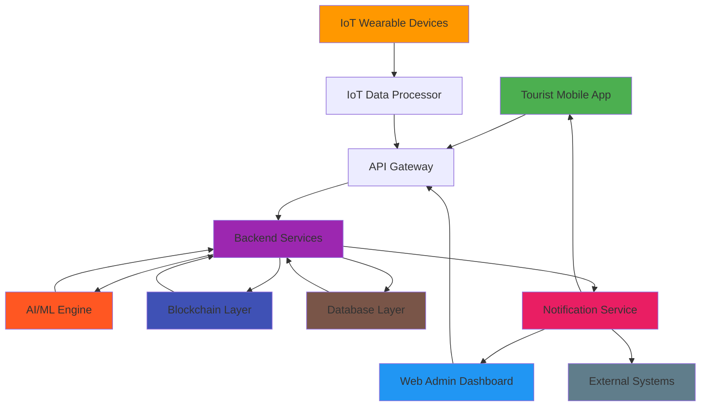
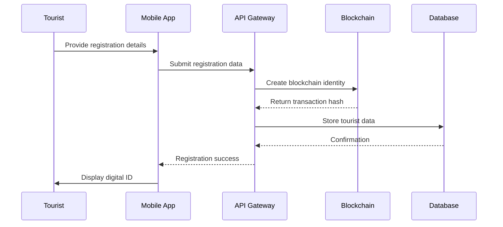
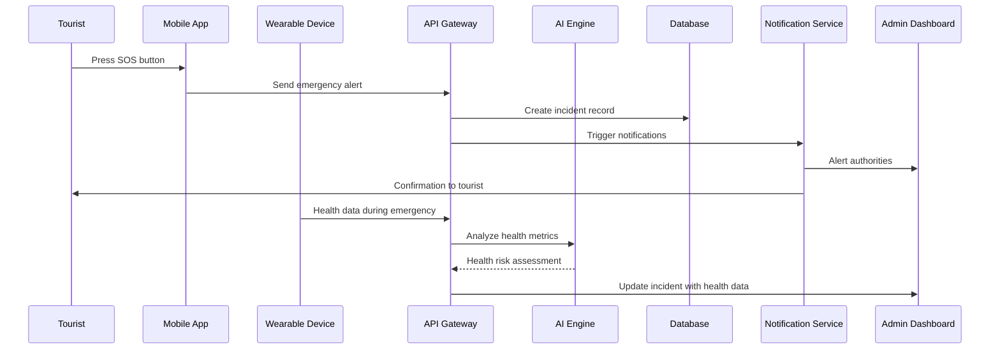
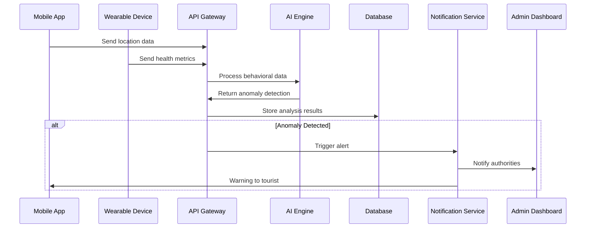

# Smart Tourist Safety System - System Architecture

## Overview

The Smart Tourist Safety Monitoring & Incident Response System is a comprehensive digital ecosystem designed to enhance the safety and security of tourists, particularly in remote or high-risk regions. The system leverages cutting-edge technologies including AI, Blockchain, IoT, and Mobile technologies to provide real-time monitoring, instant emergency response, and secure identity management.

## System Components

### 1. Tourist Mobile Application
**Platform**: React Native (iOS & Android)
**Purpose**: Primary interface for tourists to access safety features

#### Key Features:
- **Digital Identity Wallet**: Secure storage of verifiable credentials
- **Safety Dashboard**: Real-time safety score and status indicators
- **Geo-fencing Alerts**: Instant notifications for high-risk zones
- **Panic Button**: One-touch emergency alert system
- **Opt-in Tracking**: Voluntary location sharing with family/friends
- **Multilingual Support**: Interface available in 10+ Indian languages
- **Incident Reporting**: Manual and AI-assisted incident documentation
- **Itinerary Management**: Risk assessment for planned activities
- **Digital Safe**: Secure storage for personal documents and media

### 2. IoT Wearable Devices
**Platform**: Custom embedded systems with BLE connectivity
**Purpose**: Extend safety monitoring beyond smartphone capabilities

#### Key Features:
- **Continuous Location Tracking**: GPS with enhanced accuracy
- **Health Metrics Monitoring**: Heart rate, body temperature, activity levels
- **Physical SOS Button**: Waterproof emergency trigger
- **Extended Connectivity**: Works in areas with limited smartphone coverage
- **Long Battery Life**: Multi-day operation on single charge
- **Secure Data Transmission**: End-to-end encryption for all communications

### 3. Web-Based Administration Dashboard
**Platform**: React with Material-UI
**Purpose**: Command center for authorities to monitor and respond to situations

#### Key Features:
- **Real-Time Visualizations**: Interactive maps and dashboards
- **Incident Management**: Comprehensive incident tracking and response
- **Tourist Verification**: Blockchain-backed identity verification
- **Dispatch Tracking**: Real-time monitoring of response units
- **Analytics & Reports**: Safety analytics and predictive modeling
- **E-FIR Generation**: Automated electronic First Information Report creation
- **Multi-Agency Coordination**: Integrated communication across agencies

### 4. AI/ML Anomaly Detection Engine
**Platform**: Python with scikit-learn and TensorFlow
**Purpose**: Proactive monitoring for unusual tourist behavior

#### Key Models:
- **Location Drop-off Detection**: Identifies sudden loss of location signal
- **Prolonged Inactivity Detection**: Flags unusual periods without movement
- **Route Deviation Analysis**: Compares actual paths with planned itineraries
- **Behavioral Pattern Recognition**: Learns normal tourist behavior patterns
- **Risk Scoring Algorithms**: Dynamic safety assessment for locations

### 5. Blockchain Identity Management
**Platform**: Ethereum/Hyperledger with Solidity smart contracts
**Purpose**: Immutable and tamper-proof tourist identity verification

#### Key Features:
- **Digital Identity Creation**: Blockchain-based tourist credentials
- **Verification and Revocation**: Authority-controlled identity lifecycle
- **Audit Trail**: Transparent record of all identity-related actions
- **Self-Sovereign Identity**: Tourist control over personal data sharing
- **Cross-Agency Verification**: Standardized identity verification for all authorities

### 6. Backend Services
**Platform**: Node.js with Express
**Purpose**: Central coordination and data management

#### Key Services:
- **API Gateway**: Unified interface for all system components
- **Data Processing**: Real-time data ingestion and processing
- **Notification Service**: Multi-channel alert distribution
- **Storage Management**: Secure data storage and retrieval
- **Integration Layer**: Connection with external systems and databases

## System Architecture Diagram



## Data Flow Architecture

### 1. Tourist Registration Flow


### 2. Emergency Response Flow


### 3. Anomaly Detection Flow


## Technology Stack

### Frontend Technologies
- **Mobile App**: React Native, Redux, React Navigation
- **Web Dashboard**: React, Material-UI, React Router, Leaflet.js
- **Real-Time Updates**: WebSocket, Server-Sent Events

### Backend Technologies
- **Runtime**: Node.js
- **Framework**: Express.js
- **API**: RESTful with JSON
- **Authentication**: JWT, OAuth 2.0
- **Messaging**: MQTT, WebSocket

### AI/ML Technologies
- **Framework**: Python, scikit-learn, TensorFlow.js
- **Data Processing**: Pandas, NumPy
- **Visualization**: Matplotlib, Plotly
- **Model Deployment**: Flask, FastAPI

### Blockchain Technologies
- **Platform**: Ethereum/Hyperledger Fabric
- **Smart Contracts**: Solidity
- **Integration**: Web3.js, Hyperledger SDK
- **Storage**: IPFS for large data

### IoT Technologies
- **Devices**: ESP32, Raspberry Pi
- **Communication**: BLE, LoRaWAN, MQTT
- **Security**: Hardware security modules
- **Data Processing**: Edge computing with MicroPython

### Database Technologies
- **Primary**: PostgreSQL with PostGIS for geospatial data
- **Caching**: Redis for real-time data
- **Document Storage**: MongoDB for flexible schemas
- **Blockchain**: Ethereum/Hyperledger ledger

### Infrastructure
- **Cloud**: AWS/Google Cloud/Azure
- **Containerization**: Docker, Kubernetes
- **Monitoring**: Prometheus, Grafana
- **Logging**: ELK Stack (Elasticsearch, Logstash, Kibana)
- **CI/CD**: GitHub Actions, Jenkins

## Security Architecture

### Data Protection Layers
1. **Application Layer**: Input validation, authentication, authorization
2. **Transport Layer**: TLS 1.3 encryption for all communications
3. **Data Layer**: AES-256 encryption for data at rest
4. **Blockchain Layer**: Immutable audit trail for critical operations
5. **Physical Layer**: Secure data centers with biometric access

### Identity and Access Management
- **Tourist Authentication**: Multi-factor authentication with biometrics
- **Authority Access**: Role-based access control with attribute-based policies
- **Device Authentication**: Certificate-based IoT device verification
- **API Security**: OAuth 2.0 with scope-based permissions

### Privacy by Design
- **Data Minimization**: Collect only necessary information
- **Purpose Limitation**: Strict adherence to specified use cases
- **Storage Limitation**: Automated data deletion based on retention policies
- **Transparency**: Clear privacy notices and consent mechanisms

## Scalability Architecture

### Horizontal Scaling
- **Microservices**: Decomposed architecture for independent scaling
- **Load Balancing**: Automatic distribution across instances
- **Database Sharding**: Geographic and functional data partitioning
- **Caching Layers**: Multi-tier caching for performance optimization

### Performance Optimization
- **CDN**: Content delivery network for static assets
- **Database Indexing**: Optimized queries with proper indexing
- **Asynchronous Processing**: Background jobs for non-critical operations
- **Connection Pooling**: Efficient database connection management

### Disaster Recovery
- **Multi-Region Deployment**: Geographic redundancy for high availability
- **Automated Backups**: Regular data backups with point-in-time recovery
- **Failover Mechanisms**: Automatic switching to backup systems
- **Data Replication**: Real-time replication across data centers

## Integration Architecture

### External System Integrations
- **Government Portals**: Integration with Aadhaar and passport verification systems
- **Emergency Services**: Direct connection to police and medical emergency systems
- **Travel Industry**: Integration with airlines, hotels, and tour operators
- **Insurance Providers**: Automated claims processing and verification
- **Transportation Networks**: Real-time integration with public and private transport

### API Ecosystem
- **Public APIs**: Tourist-facing interfaces for registration and safety features
- **Partner APIs**: Integration points for travel industry partners
- **Authority APIs**: Secure interfaces for law enforcement and emergency services
- **Internal APIs**: Service-to-service communication within the system

## Deployment Architecture

### Cloud Deployment
```mermaid
graph LR
    A[Internet] --> B[Load Balancer]
    B --> C1[Web Frontend - Zone 1]
    B --> C2[Web Frontend - Zone 2]
    C1 --> D[API Gateway]
    C2 --> D
    D --> E1[Microservice 1 - Zone 1]
    D --> E2[Microservice 1 - Zone 2]
    D --> F1[Microservice 2 - Zone 1]
    D --> F2[Microservice 2 - Zone 2]
    E1 --> G[(Database - Primary)]
    E2 --> H[(Database - Replica)]
    F1 --> I[(Cache - Zone 1]
    F2 --> J[(Cache - Zone 2]
    
    style G fill:#4CAF50
    style H fill:#8BC34A
    style I fill:#FF9800
    style J fill:#FFC107
```

### Edge Computing
- **IoT Gateways**: Local processing for wearable device data
- **Mobile Edge**: Offline capabilities for mobile applications
- **Regional Caching**: Geographically distributed content delivery
- **Federated Learning**: Distributed AI model training

## Monitoring and Observability

### System Monitoring
- **Infrastructure**: CPU, memory, disk, and network utilization
- **Application Performance**: Response times, error rates, throughput
- **Business Metrics**: User engagement, incident response times, safety scores
- **Security Monitoring**: Intrusion detection, access pattern analysis

### Logging Architecture
- **Structured Logging**: JSON format for easy parsing and analysis
- **Centralized Logging**: Unified log aggregation and search
- **Real-Time Alerts**: Automated notification for critical events
- **Audit Trails**: Comprehensive record of all system activities

### Analytics and Reporting
- **Real-Time Dashboards**: Live system status and performance metrics
- **Historical Analysis**: Trend analysis and pattern identification
- **Predictive Analytics**: Machine learning for future incident prediction
- **Compliance Reporting**: Automated reports for regulatory requirements

## Conclusion

The Smart Tourist Safety System architecture is designed to be secure, scalable, and compliant with Indian data protection laws while providing comprehensive safety features for tourists. The modular design allows for independent development and deployment of components while maintaining system integrity and performance.